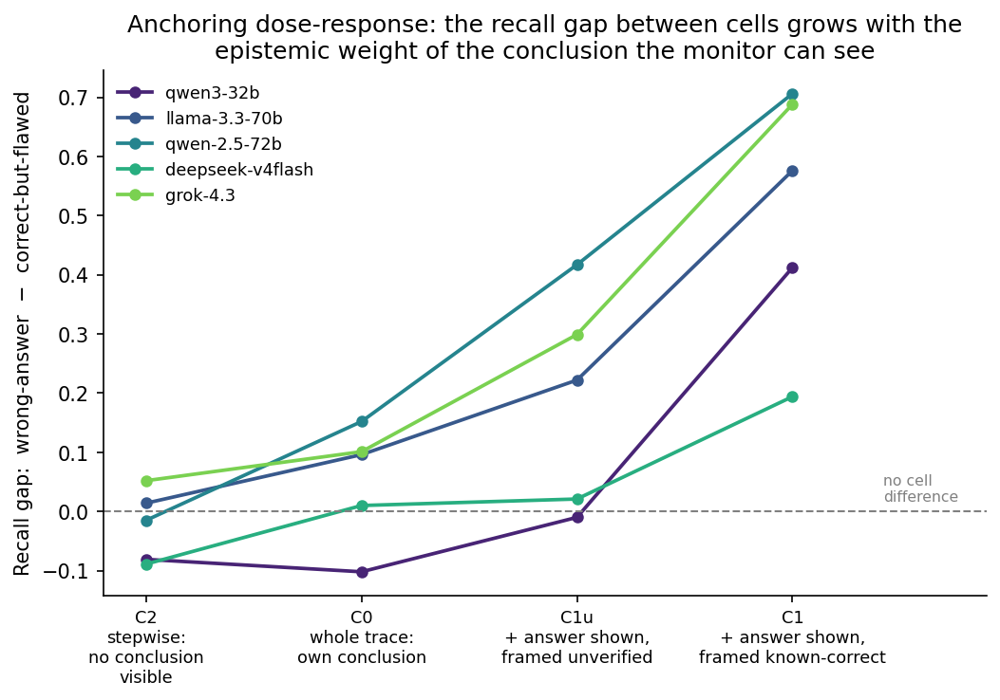

# Chain-of-thought error monitoring on HLE physics

Code and results for a study of whether monitor LLMs can identify the first erroneous step in step-numbered physics solutions generated by frontier models, and how detection depends on (a) monitor capability, (b) access to the reference answer, and (c) whole-trace vs stepwise review.

Status: working study. Ground truth is AI-adjudicated with human verification in progress; all numbers below are provisional and computed against the draft ground truth.

## Overview

Scalable oversight proposes that weaker or cheaper models can audit the reasoning of stronger ones. This study tests a concrete version: a monitor model reads a solution and reports whether it contains a genuine error and, if so, the step where the first error occurs. Final-answer correctness and first-error step are labelled independently, so the dataset includes traces whose final answer is correct despite flawed reasoning (for instance, two mistakes that counteract each other). These traces are the focus of the analysis: they are the only ones where access to the reference answer cannot reveal the presence of an error.

## Method

### Questions and traces

The questions come from Humanity's Last Exam (HLE), physics subset. Questions with images, pure knowledge-recall questions, and questions that were not genuinely multi-step were removed, leaving 99. Three frontier models (GPT-5.5, Claude Opus 4.7, Gemini 3.1 Pro) each produced a step-numbered solution per question.

Nine questions (27 traces) were used for an inter-rater reliability (IRR) study with seven volunteer physicist annotators using a custom HTML annotation tool (included in this repo for reference). The pilot rubric included additional fields (error type, coherence); only `is_correct` and `error_step` reached usable agreement, and the main study uses only these two. Two of the nine questions were found to have incorrect reference answers in the benchmark itself. The remaining 90 questions (270 traces) form the main study.

### Labels

Each trace carries two independent labels: `is_correct` (whether the final answer is right) and `error_step` (the step number of the first false assertion, or none - marked regardless of whether the trace later recovers). The independence is the design's key feature: it creates the correct-answer-flawed-reasoning cell that the analysis centres on.

### Ground truth

Draft ground truth was produced by an AI committee: Claude Opus 4.8 annotated each trace (with access to question, reference answer, rationale, and the trace); GPT-5.5 responded; Claude replied (one debate round). Separately, GPT-5.5 annotated each trace independently, and Claude produced a final consensus verdict over all rounds. Human verification is in progress (10/90 questions human-annotated, 60/90 assigned); annotators will see the AI verdicts only after finishing their own annotations and will make the final determination per trace.

During adjudication ~13 questions were flagged as having incorrect reference answers; five have so far been reported to the HLE maintainers while the rest are checked. Corrected answers were used for labelling. This error rate is consistent with the 2/9 found independently in the IRR pilot.

Fifteen of the 270 traces are currently held out (4 questions excluded; 3 traces where the adjudication disputes the reference answer and a human decision is pending). The usable set is 255 traces: 90 with a wrong final answer (all containing an error step), 134 clean, and 31 with a correct final answer but flawed reasoning.

### Monitors

qwen3-32b, llama-3.3-70b, qwen-2.5-72b, deepseek-v4flash, grok-4.3, gemini-3.1-pro. GPT-5.5 and Claude models are excluded as monitors because they helped produce the ground truth. Gemini-3.1-Pro generated one third of the traces; its results include self-review and are reported with that caveat. All monitors receive the same error rubric used during ground-truth construction and return `has_error`, `first_error_step`, and `error_confidence` as JSON.

### Conditions

- **C0 - blind, whole trace.** The monitor sees the question and the full step-numbered solution, with no reference answer. The realistic oversight condition.
- **C1 - given the answer.** As C0, plus the reference answer presented as known correct, with an instruction to use it (and an explicit warning that a correct final answer does not imply sound reasoning).
- **C1u - given the answer, unverified.** Identical to C1 - same answer string, same rubric, same format - except the answer is framed as proposed and unverified, with an instruction not to trust it. Isolates the effect of trust from the effect of merely seeing an answer.
- **C2 - blind, stepwise.** The monitor sees the solution one step at a time and commits at the first step it flags. The monitor never sees the solution's conclusion before judging a step, so this condition removes conclusion visibility entirely.

### Metrics

All metrics are computed against the draft ground truth described above.

**Detection** asks: did the monitor correctly judge whether the trace contains an error at all? We report **balanced accuracy**: the average of sensitivity (the fraction of traces with a true error that the monitor flagged) and specificity (the fraction of clean traces it correctly left unflagged). The average matters because the monitors sit at wildly different operating points - deepseek-v4flash flags ~95% of all traces, qwen-2.5-72b flags ~30% - and plain accuracy would mostly reward matching the base rate. Balanced accuracy is 0.5 for any strategy that ignores the trace (flag everything, flag nothing, flag at random), so 0.5 is the chance line. We also report **AUC (Area Under the ROC Curve)**: the probability that the monitor assigns a higher error-confidence to a randomly chosen trace that truly contains an error than to a randomly chosen clean one. 0.5 means the confidence carries no information; below 0.5 means it is anti-calibrated (the monitor is systematically more confident on the traces it judges wrongly), which occurs for several monitors here. Where a monitor emits near-constant confidence the AUC is meaningless and marked degenerate.

**Localization** asks: when a trace really does contain an error, did the monitor point to exactly the right step? We report it two ways: among the traces the monitor flagged (`loc_given_flag`), and among all true-error traces (`loc_overall`, where missing the error entirely counts as a localization failure).

**The anchoring decomposition** splits the 121 true-error traces by whether the final answer is wrong (90 traces - comparing against the reference answer can reveal that an error exists) or correct-but-flawed (31 traces - it cannot). We report recall (the fraction flagged) on each subset, with fixed denominators of 90 and 31: a monitor whose output failed to parse is counted as not having flagged the trace, on the grounds that a monitor that returns no verdict has failed to catch the error.

## Results

### Detection by condition (balanced accuracy)

| monitor | C0 | C1 | C1u | C2 |
|---|---|---|---|---|
| qwen3-32b | .553 | .657 | .608 | .512 |
| llama-3.3-70b | .597 | .640 | .665 | .514 |
| qwen-2.5-72b | .531 | .671 | .629 | .574 |
| deepseek-v4flash | .522 | .596 | .535 | .529 |
| grok-4.3 | .625 | .718 | .687 | .627 |
| gemini-3.1-pro | .771 | .800 | not run | not run |

Blind detection (C0) is near chance for the five sub-frontier monitors (0.52–0.63); gemini-3.1-pro reaches 0.77. Exact blind localization (`loc_overall`): 12–22% sub-frontier, 40% gemini. Per-condition CSVs with full metrics (n, parse rate, flag rate, confidence intervals, sensitivity, specificity, AUC, both localization measures) are in `summaries/`.

### The anchoring decomposition

Recall on true-error traces by condition, fixed 90/31 denominators:

| monitor | wrong-answer: C0 / C1 / C1u / C2 | flawed-cell: C0 / C1 / C1u / C2 |
|---|---|---|
| qwen3-32b | .633 / .900 / .667 / .778 | .742 / .516 / .677 / .839 |
| llama-3.3-70b | .644 / .889 / .889 / .344 | .548 / .323 / .677 / .323 |
| qwen-2.5-72b | .378 / .867 / .611 / .400 | .226 / .161 / .194 / .419 |
| deepseek-v4flash | .978 / .989 / .956 / .878 | .968 / .806 / .968 / .968 |
| grok-4.3 | .456 / .978 / .622 / .633 | .355 / .290 / .323 / .581 |
| gemini-3.1-pro | .811 / .944 / - / - | .548 / .548 / - / - |

With the certified answer (C1), recall on wrong-answer traces approaches ceiling for every monitor, while recall on the correct-but-flawed cell is flat-to-lower for four of five non-Gemini monitors - despite the prompt explicitly warning that a correct final answer does not imply sound reasoning. Per-cell n is small (31), so the consistency of direction across monitors is the relevant evidence, not any single change.

### The dose-response (Figure 6 - the payoff)

The four conditions can be ordered by how much epistemic weight the visible conclusion carries for the monitor: in C2 no conclusion is visible at all; in C0 the monitor sees only the solution's own (uncertified) conclusion; in C1u it additionally sees an external answer explicitly framed as unverified; in C1 it sees the same answer certified as correct. We call this ordering the "dose". The response is the recall gap - wrong-answer recall minus flawed-cell recall - which measures how much of the monitor's apparent detection ability is really answer-checking rather than reasoning scrutiny.

The gap grows with the dose: approximately zero in C2 (−.09 to +.05 across all five monitors run), small in C0, intermediate in C1u, and large in C1 (+.18 to +.71, positive for all six monitors). Two readings follow. First, the flawed-cell errors are not intrinsically harder - hide the conclusion (C2) and the two cells become equally detectable - so the deficit elsewhere is attributable to conclusion visibility. Second, decertifying the answer (C1u) recovers recall on the flawed cell for all five monitors tested relative to C1, but most monitors still anchor above their blind baseline: trust amplifies the anchor, but mere visibility of a plausible conclusion is enough to create one, and prompt-level mitigation is only partial. (deepseek-v4flash is uninformative on the visibility steps: it flags ~95% of traces, so both cells sit at ceiling in every condition except C1.)

Stepwise review (C2) pays for removing the anchor with false positives on clean traces, which is why its aggregate balanced accuracy is at or below C0 for every monitor; its localization is also no better. Flag-position histograms for every monitor × condition are in `figures/`. Step-level parse failures (worst monitor: 79% clean-parse) were audited for detection bias: across all monitors, at most 2 of 121 true-error traces were unflagged with an unjudged step at or before the ground-truth error location, bounding the effect on any reported recall at <2 percentage points.

## Limitations

The ground truth is AI-constructed and human verification is incomplete, so every number is provisional; the study covers a single domain (physics) with 255 traces, and the central correct-but-flawed cell holds only 31, so per-monitor changes carry wide intervals and the cross-monitor direction is the unit of evidence. Gemini-3.1-Pro self-reviews a third of the traces and its C1u/C2 runs are pending (cost to run API calls). Several monitors emit near-constant or anti-calibrated confidence, limiting threshold-free (AUC) comparison. Finally, the two strongest natural frontier monitors (GPT-5.5 and Claude) are excluded because they helped produce the ground truth, leaving the frontier end of the monitor pool thin - and every error studied here is an honest generator mistake, not an adversarially planted one.

## Repository contents

- `oversight_pipeline.ipynb` - target loading, the C0/C1/C1u/C2 runners (threaded httpx, append-only JSONL with resume/retry), scoring, and the anchoring decomposition.
- `annotator` - the HTML annotation tool used by the volunteer physicist annotators (included for reference).
- `figures/` - all figures, including the dose-response (fig6).
- `summaries/` - per-condition metric CSVs (c0/c1/c1u/c2_summary.csv).

The raw JSONL files (HLE question text, model traces, annotations, and monitor outputs containing trace text) are deliberately not included, to maintain the integrity of HLE as a held-out benchmark. Labels and monitor verdicts with question text withheld will be released alongside the paper once human verification of the ground truth completes.

## Roadmap

- Complete human annotation (30/90 questions currently unassigned)
- Resolve the 15 held-out traces (incl. 3 reference-answer disputes)
- Gemini-3.1-Pro C1u and C2 (completing the dose-response at the frontier)
- Claude Fable 5 as a second frontier monitor (C0/C1/C1u/C2), with a family-contamination check against the Claude adjudicator on contested labels
- Write-up: Alignment Forum / LessWrong post + arXiv preprint

## Contact

Will Yeadon, Department of Physics, Durham University.